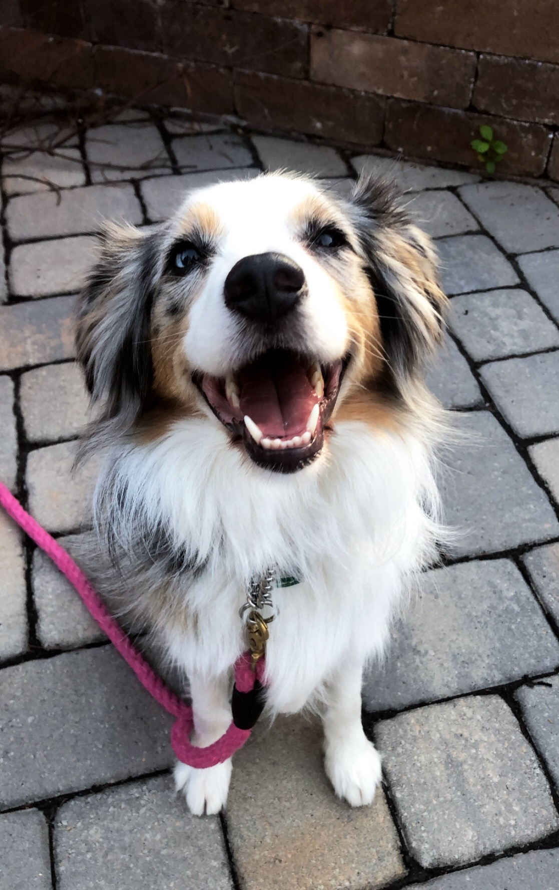

# About this site

This site is intended for homework 4 of P8105, a class on data science. It was made in RStudio and hosted on github. All the code information can be found by clicking on the github icon on the top right!

# Resume

## EDUCATION

### Mailman School of Public Health, Columbia University
Masters in Epidemiology, Expected 2022

### Icahn School of Medicine at Mount Sinai
Masters in Public Health, June 2020
Concentration in Global Health

### The City College of New York, New York, NY
Bachelor of Science, May 2015
Major in Biochemistry, minor in Studio Art

## Research Experience

### Columbia University Medical Center, Jan 2017-Present
#### Cardiology Core Lab Research Assistant

My first introduction to public health was an undergrad internship with HealthLeads.  As part of my MPH, I traveled to Uganda to understand and address knowledge gaps in HPV immunizations and cervical cancer screenings. 

I am an active volunteer. My favorite organizations are [Hole in the Wall Gang Camp](https://www.holeinthewallgang.org/) and [New York City Hemophilia Chapter](https://www.nyhemophilia.org/).

## About me!

Welcome to my very first website (excluding the ones we made in class)! My name is Nidhi, I grew up in Westchester and am very stressed about this election. I have an older sister and a puppy named Nova!

Here's a pic of Nova!!

  